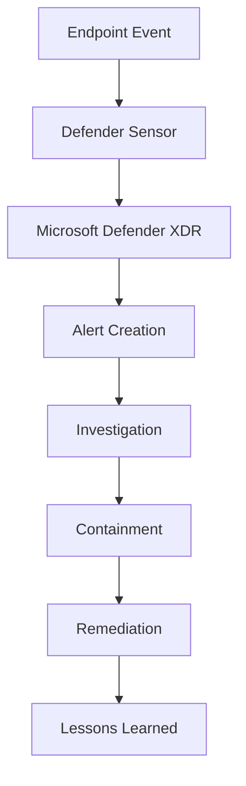

# Security Operations Flow

```mermaid
flowchart TD

A[Endpoint Event] --> B[Defender Sensor]
B --> C[Microsoft Defender XDR]
C --> D[Alert Creation]
D --> E[Investigation]
E --> F[Containment]
F --> G[Remediation]
G --> H[Lessons Learned]
```
